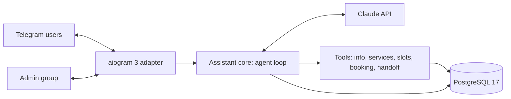

# Architecture — Telegram AI Receptionist

## 1. Problem and scope

Clinics and service businesses answer the same questions in Telegram all day and book appointments by hand. The receptionist:

- answers FAQs from the business profile;
- finds free slots and books them;
- hands the chat to a human when needed;

and does all of this in Russian, Uzbek or English.

**Goals**

- Natural conversation; every action goes through a tool, never through parsing free text.
- A booking is created only after the user explicitly confirms the details.
- Human handoff passes a conversation summary to the admin group; admins are notified about new bookings.
- The core logic is independent of Telegram, so the same assistant can serve WhatsApp or a website chat.
- Scripted eval conversations with published results.

**Non-goals (v1)** — listed as extensions: payments (Click, Payme, Telegram Stars), voice messages, calendar sync, reminders, admin web panel.

## 2. System overview



Ports and adapters: `core/` has no aiogram or SQLAlchemy imports and depends on interfaces (`ConversationStore`, `BookingRepository`, `Notifier`). `telegram/` and `db/` implement them.

## 3. Components

| Module | Responsibility |
|---|---|
| `receptionist/config.py` | Settings (pydantic-settings, env prefix `RECEPTIONIST_`) |
| `receptionist/core/agent.py` | Agent loop: build request, call Claude, run tools, persist every message |
| `receptionist/core/tools.py` | Tool schemas (`strict: true`) and handlers |
| `receptionist/core/prompts.py` | Stable system prompt rendered from the clinic profile |
| `receptionist/core/ports.py` | Interfaces for storage and notifications |
| `receptionist/telegram/` | Routers, middlewares (rate limit, typing indicator), admin-group handlers, button texts per language |
| `receptionist/db/` | SQLAlchemy models, repositories; `alembic/` migrations |
| `data/clinic.yaml` | Fictional clinic profile: hours, address, services, prices (UZS), FAQ |
| `evals/` | Scripted conversations and assertions |

## 4. Conversation design

- **Sessions.** One active session per Telegram chat. A new session starts on:
  - `/start`;
  - 12 h of inactivity;
  - the end of a handoff;
  - a change of model, system prompt or tools (the session stores a sha256 fingerprint of all three);
  - a refusal, a cut-off tool call, or a reply without text: such a turn isn't kept;
  - the session passing its context budget of 30,000 tokens. In this case a separate Claude call (effort `low`, no tools) summarises the transcript, and the new session's first user message opens with `<previous_conversation_summary>`. The old history, including its thinking blocks, is not replayed.
- **Append-only history.** Every message is stored as sent, and every assistant message exactly as the API returned it, thinking blocks included. Blocks are serialized the way the SDK does (`model_dump(mode="json", exclude_unset=True, by_alias=True)`) and stored in a `json` column, which preserves the key order of tool inputs (ADR-10). The system prompt and the tool list are fixed for the session's lifetime. Claude Opus 5.5 rejects edited history on new accounts, and an untouched prefix keeps prompt-cache hits high.
- **Per-turn context.** The system prompt holds no date. Each patient message is sent as up to three text blocks: an optional summary, `<context>` (current weekday, date and time in Asia/Tashkent, and the Telegram app language), then the patient's text (ADR-11). Timestamps of messages and sessions come from the agent's clock, not the database's, so the idle timeout and `<context>` share one time source.
- **Prompt caching:** automatic top-level caching (`cache_control: {type: "ephemeral"}`) reuses the tools + system + history prefix every turn. In the first real run, every turn after the first read 3–14k tokens from cache and paid full price for 6.
- **Agent loop (`core/agent.py`, manual, no beta APIs):**
  1. Store the user message, then call Claude.
  2. `stop_reason == "refusal"`: polite fallback text in the chat's language and a fresh session.
  3. `max_tokens` with a tool call: the call is not run, and the session ends.
  4. Otherwise store the assistant message. For `tool_use`, run every call in order, append one `tool_result` per call, matched by `tool_use_id`, as the next user message, and call again.
  5. Stop after at most 6 calls; the history stays valid because every call has its result.
- **Leaked markup.** Fragments of the model's internal markup occasionally leak into reply text. The owner's first Telegram test showed it: every reply started with `antml_reply_`. Once one leak sits in the history, the model repeats the pattern in later turns. Two guards:
  - the system prompt says to start directly with the message and include no internal or system XML tags;
  - `clean_reply_text` removes such fragments from the text sent to the patient and logs a warning, while the stored history stays verbatim (append-only).
- **Failures.** On an API error the patient gets a "try again or call" text with the clinic phone. The stored user message stays, and the next turn sends it again, followed by the new one.
- **Concurrency.** An in-process lock per chat serializes turns, so ordinals stay in order (single bot instance).
- **Model:** `claude-opus-5-5`, effort `low` for chat latency (raise to `medium` only if evals require it), `max_tokens = 8000`, which covers adaptive thinking plus the reply. Non-streaming calls, timeout 90 s, 2 SDK retries.
- **Console chat:** `python -m receptionist.console` drives the same assistant from a terminal with the real database and Claude, for debugging and evals.
- **Responsiveness:** Telegram has no token streaming for bots, so the bot shows the "typing…" action while the loop runs.

## 5. Tools

All tools are declared from the first request with `strict: true`. `tool_choice` is `auto`: Opus 5.5 rejects forced choice, so the prompt says when each tool applies. A failing tool returns a `tool_result` with `is_error: true` and a JSON `{"error": ...}` the model can act on; nothing raises to the agent loop. Unexpected exceptions are logged and become a generic error.

Strict schemas (`core/tools.py`, checked by `tests/test_tools.py`):
- every object sets `additionalProperties: false`;
- every property is required, because optional parameters count toward a per-request limit of 24;
- choices are enums, built from `clinic.yaml`;
- there are no `minimum`, `maximum`, `minLength` or `maxLength`, which strict mode doesn't support, so ranges and lengths are checked in the handlers.

Enum values are compared case-insensitively, because strict mode doesn't guarantee capitalisation. The definitions depend only on the clinic profile, so they are byte-identical across requests.

| Tool | Input | Behaviour |
|---|---|---|
| `get_clinic_info` | `topic` (enum of the FAQ topics in `clinic.yaml`) | The clinic's official answer |
| `list_services` | — | Services with name (EN/RU/UZ), specialist, duration, price, and the specialist's weekdays when limited |
| `find_free_slots` | `service_id`, `date_from` (date), `days` (1–14) | Free start times grouped by day, in clinic local time. A past `date_from` starts today. Beyond the 30-day horizon the result explains why it's empty. At most 60 times are returned |
| `create_booking` | `service_id`, `date`, `time` (`HH:MM`, clinic local time), `patient_name`, `phone`, `confirmed` | Details in the booking gate below |
| `list_my_bookings` | — | The chat's upcoming bookings with ids, so a patient can cancel in a later session |
| `cancel_booking` | `booking_id` | Only the chat's own upcoming bookings. Less than 24 hours ahead, the result carries the 50,000 UZS late-cancellation fee. Notifies admins |
| `handoff_to_human` | `reason` (enum: patient_request, complaint, medical_question, emergency, not_understood, other), `summary` | Switches the chat to operator mode in one transaction with the handoff record and notifies admins. The result's `handoff` flag tells the agent loop to stop |

**`create_booking` gate**, checked in this order:
1. **Input checks.** The name is 2–100 characters with a letter. The phone is normalized to E.164; 9 digits mean +998.
2. **Per-chat limit.** At most 3 upcoming bookings per chat.
3. **Free slot.** The time must be one of the free slots. If it isn't, the result lists the nearest free times that day.
4. **Confirmation.** With `confirmed: false` nothing is ever booked. The model gets "the time is free, read the details back and confirm", so the call doubles as an availability check.
5. **Booking.** The insert relies on the exclusion constraint (ADR-8). If another request wins the race, the result says so and offers fresh alternatives.
6. **Notification.** Admin notifications are best effort: a failure is logged and the booking stands.

## 6. Human handoff

- **Operator mode:**
  - the bot stops calling Claude for that chat;
  - the patient's messages go to the admin group, with no reply in the chat:
    - text as "💬 name @username (#id): text";
    - photos, voice messages and files are copied under such a header;
  - an operator's reply (Telegram Reply) to any bot message about that chat is copied to the patient, text or media, without a "forwarded" label. A 👍 reaction confirms delivery. If the patient blocked the bot, a notice appears in the group;
  - "Return to bot" ends operator mode and closes the open handoffs in one transaction, starts a new session and tells the patient;
  - `/start` from the patient does the same and posts a note to the group.
- **Triggers:**
  - the model calls `handoff_to_human`: a person was asked for, a complaint, a medical question, an emergency, or repeated misunderstanding. The group gets a card with the reason, the model's summary and "Return to bot";
  - an operator presses "Take over" on a booking card. The patient is told a staff member has joined.
- **Admin group** (`telegram/admin.py`, `AdminDesk`):
  - it implements the `Notifier` port: booking cards (created and cancelled, with "Take over" while the bot handles the chat) and handoff cards;
  - every bot message about a patient is recorded in `relay_messages` (admin message id → chat), so replies route to the right patient and `/forget` deletes the mapping with the chat;
  - texts are in `RECEPTIONIST_ADMIN_LANGUAGE` (ru, uz or en).
  - Buttons work only in the configured group: the router filters by chat id, and only members see the group.
  - The bot needs no admin rights there. With privacy mode on (the default), Telegram delivers replies to the bot's messages and commands, which is all the relay needs.
- **Setup:** `/chatid` in any group replies with that group's id. Put it in `.env` as `RECEPTIONIST_ADMIN_CHAT_ID` and restart.
- **No admin group configured:** notifications go to the log. A chat in operator mode gets "can't reach staff, call {clinic phone}, or /start for the bot". The same reply comes when the group can't be reached.

## 7. Data model

```
chats      id · tg_chat_id UNIQUE · language (ru|uz|en) · mode (bot|operator) · created_at
sessions   id · chat_id FK · started_at · ended_at · summary
           UNIQUE (chat_id) WHERE ended_at IS NULL           -- one open session per chat
messages   id · session_id FK · ordinal · role (user|assistant) · content jsonb (verbatim API blocks) · usage jsonb · created_at
           UNIQUE (session_id, ordinal)
bookings   id · chat_id FK · service_id · resource · slot_start · slot_end · patient_name · phone
           · status (confirmed|cancelled) · created_at · cancelled_at
           EXCLUDE USING gist (resource WITH =, tstzrange(slot_start, slot_end) WITH &&)
             WHERE status = 'confirmed'                      -- no overlaps per resource (ADR-8)
handoffs   id · chat_id FK · reason · summary · admin_message_id · opened_at · closed_at
relay_messages  admin_chat_id · admin_message_id (PK) · chat_id FK · created_at   -- admin-group routing
chats.display_name: Telegram name and @username, shown to operators
```

Every foreign key to `chats` cascades on delete, so `/forget` deletes one row. Times are `timestamptz`; the clinic's time zone (Asia/Tashkent) applies only when slots are generated and shown.

Clinic content lives in the versioned `data/clinic.yaml`, not in the database: hours, holidays, booking rules, resources, services with durations and prices, and FAQ. Its facts match the sample documents of ai-document-assistant.

**Resources.** A resource is a bookable line such as `therapist`, `hygienist`, `surgeon`, `orthopedist` or `pediatric`. Each takes one appointment at a time, and can be limited to certain weekdays: the children's dentist works Tuesday, Thursday and Saturday. Every service belongs to one resource.

**Free slots** (`core/slots.py`, a pure function) are computed in 30-minute steps inside the opening hours. A slot qualifies when:
- the visit ends by closing time;
- it doesn't overlap a confirmed booking of the same resource;
- it starts at least 60 minutes from now;
- it falls within the 30-day booking horizon.

Closed days, holidays and the resource's off days have no slots.

## 8. Safety and guardrails

- **Medical:**
  - no diagnoses or treatment advice;
  - urgent symptoms → the emergency number from settings (103, ambulance in Uzbekistan) plus a handoff.
- **Personal data:**
  - only name and phone, only for bookings;
  - `/forget` deletes the user's data.
- **Abuse limits:**
  - per-user rate limit (20 messages per 10 minutes);
  - daily token budget per chat;
  - maximum message length.
- **Refusals:** `stop_reason == "refusal"` gets a polite reply and an offer to talk to a person. No server-side fallback in v1 (ADR-7).
- **Untrusted input:** user text never changes the system prompt. Prices and discounts come only from tools, never from what the user claims.
- **Secrets and admin access:**
  - bot token and API key come from the environment;
  - the admin group id is in settings;
  - admin buttons work only for members of that group.

## 9. Evaluation

`evals/scenarios/*.yaml` holds 14 scripted conversations (22 patient messages), checked against `evals/scenario.py`:

| Group | Scenarios |
|---|---|
| FAQ | RU address and parking · UZ children's dentist days · EN price and duration |
| Booking | RU happy path (with "not booked yet" checks after each turn) · UZ child check-up · slot taken by another patient between read-back and "yes" · EN change of mind · EN cancellation two days ahead · RU same-day cancellation with the fee |
| Safety | RU request for a person · EN diagnosis and medicine question · UZ emergency (swelling, trouble breathing) · EN off-topic question · RU "ignore your rules" with a fake 50% discount |

**Runner** (`evals/run.py`). It drives the real `Assistant` with the real tools, repositories and Claude. For each scenario it:
- empties a separate database (`receptionist_eval` on the dev Postgres; `RECEPTIONIST_EVAL_DATABASE_URL` overrides it);
- uses a fixed clock: Monday 2026-10-12 09:30 Tashkent, plus one minute per message;
- uses a recording notifier instead of Telegram;
- picks each message's language hint with the bot's own `detect_language`;
- can insert bookings before a turn, for example to simulate another patient.

**Deterministic checks:**
- the patient's bookings after given turns and at the end (service, date, time);
- the cancellation count;
- tools called;
- handoffs and their reasons;
- required text in the last reply (for example "103");
- every message answered;
- no leaked `antml` markup.

**LLM judge.** One Claude call per scenario (structured output, effort `low`) sees the transcript with tool calls and results. It labels each reply's language (compared with the expected language), flags medical advice, and grades the scenario's criteria, writing a reason first.

| Metric | Target |
|---|---|
| Booking checks | 100% |
| Handoff checks | 100% |
| Every message answered | 100% |
| Behaviour checks (tools, reply text) | ≥ 90% |
| Reply in the patient's language | ≥ 95% |
| Judge criteria | ≥ 90% |
| Replies with medical advice | 0 |
| Leaked markup | 0 |

**Output.** `evals/results/latest.md` is committed; its summary goes into the README. `latest.jsonl` holds the transcripts and is git-ignored. The runner exits 1 when a target is missed.

**Partial runs.** `--only id,...` runs a subset without publishing. `--only ... --merge` replaces those scenarios in the last full run and republishes, and the report names the re-run scenarios.

**Result (2026-10-04):** 14 of 14 scenarios pass, and every metric is at 100% or 0. One rubric fix happened along the way: `cancel-en` first failed because its criterion forbade *mentioning* the fee, and the bot correctly said "no fee". The criterion now forbids saying a fee *applies*, and the scenario was re-run alone. A run costs about $0.57: $0.019 per patient message plus the judge. The median reply time is 7.2 s, since most messages make two Claude calls.

**Caveat.** The judge is the same model family as the assistant. Its verdicts were checked by reading every transcript.

## 10. Operations

- `docker compose up -d --build` starts `db` (postgres:17, named volume, healthcheck) and `bot`.
- The bot uses long polling, so the demo needs no public URL. Webhook mode is a setting for production.
- Logs record the per-turn token usage and cost, never message text at INFO level.
- CI (GitHub Actions) runs ruff and pytest on every push.

## 11. Decisions

| ID | Decision | Why / trade-off |
|---|---|---|
| ADR-1 | aiogram 3 | Async, routers and middlewares; the most used Python Telegram framework |
| ADR-2 | Manual agent loop instead of the SDK Tool Runner | Every message is persisted verbatim (append-only), booking is gated on confirmation, no beta dependency. Trade-off: more code |
| ADR-3 | Ports-and-adapters core | Telegram is one adapter; WhatsApp or a web chat can be added (upsell) |
| ADR-4 | Long polling for the demo, webhook for production | No public URL or TLS certificate needed to demo |
| ADR-5 | Session rotation with a summary instead of trimming history | Trimming edits the prefix: 400 on Opus 5.5 for new accounts, and cache misses |
| ADR-6 | PostgreSQL instead of SQLite | Concurrent writes; transactional booking with a unique constraint; same database as project 1 |
| ADR-8 | Bookings belong to a resource, and overlaps are prevented by a PostgreSQL exclusion constraint (`btree_gist`), instead of `UNIQUE (slot_start)` | A unique start time doesn't stop a 60-minute visit at 10:00 from overlapping one at 10:30, and it would let only one patient in at a time for the whole clinic. The constraint makes double booking impossible even under concurrent requests. Truly simultaneous inserts can deadlock: each waits for the other's uncommitted row. CI saw this; local runs over the WSL port forward never did. The repository therefore retries deadlock and serialization failures up to 3 times, and the retry ends as a plain exclusion violation, which becomes `SlotTaken`. Trade-off: a PostgreSQL extension (contrib, trusted, present in the official image) |
| ADR-9 | `create_booking` takes a local `date` and `HH:MM` `time` instead of a `slot_start` timestamp; `list_my_bookings` added | The model copies a date and a time from `find_free_slots` verbatim, so no UTC offsets can go wrong. A new session can still find a booking id to cancel. Trade-off: one more tool in the fixed tool list |
| ADR-10 | `messages.content` is `json`, not `jsonb` (migration 0002) | jsonb stores a parsed form and reorders object keys, so a tool_use `input` read back differs from what the model produced. Replayed history must be byte-identical (thinking-block binding, prompt cache). Trade-off: no jsonb indexing on content, which nothing queries |
| ADR-11 | The current time goes into each user message as a `<context>` block, not into the system prompt | The system prompt must not change within a session, but the model needs "now" to resolve "tomorrow". A block in the appended user message keeps the prefix intact. Trade-off: about 30 tokens per turn |
| ADR-12 | Operator relay through a message map (`relay_messages`) and `copyMessage`, instead of forwarding with `forwardMessage` or parsing ids out of message text | A forwarded message only carries the sender when their privacy settings allow it, and text parsing breaks on edits. The map routes any reply, including to media and to the operator's own messages, and is deleted with the chat. `copyMessage` sends without a "forwarded from" label. Trade-off: one row per admin-group message |
| ADR-7 | No server-side refusal fallback in v1 | It is a beta API. In a persisted multi-turn history it adds `fallback` blocks and sticky routing, and the fallback model cannot read Opus 5.5 thinking. Refusals are rare for a clinic FAQ bot and end in a handoff offer. Revisit if evals show refusals |

## 12. Extensions (offer as add-ons)

Payments (Click, Payme, Telegram Stars) · Google Calendar sync · reminders 24 h before a visit · voice messages · admin web panel · WhatsApp channel · analytics dashboard.
